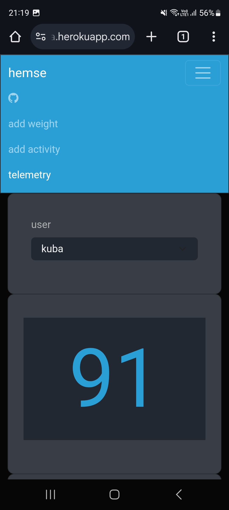
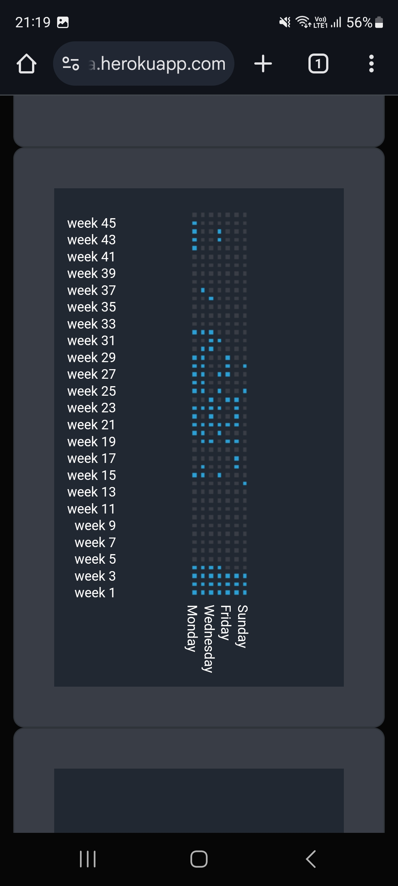

# Hemse

This project is a frontend for [Visby](https://github.com/klawik-j/visby), designed to display various data related to fitness training. It allows users to view and track their fitness metrics as well as add data, such as weight measurements and different types of activities.

## Instalation
```
pip install hemse
export BACKEND_URL=hosted-visby-app-url
gunicorn hemse.app:server --bind 0.0.0.0:$8000
```

## Examples






## Contact
[](https://www.linkedin.com/in/klawikowski-jakub)
[](mailto:klawik.j@gmail.com)
